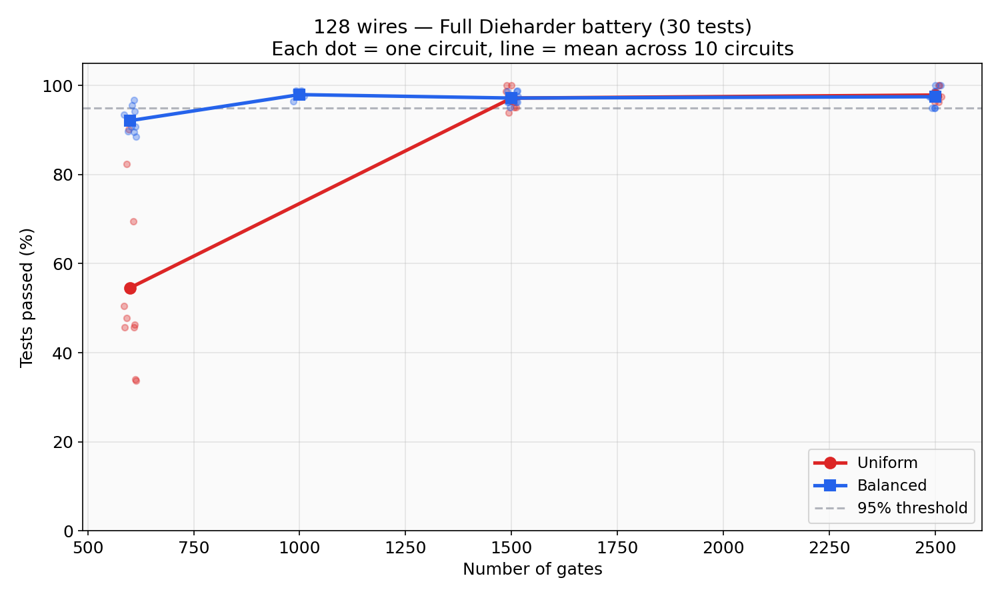
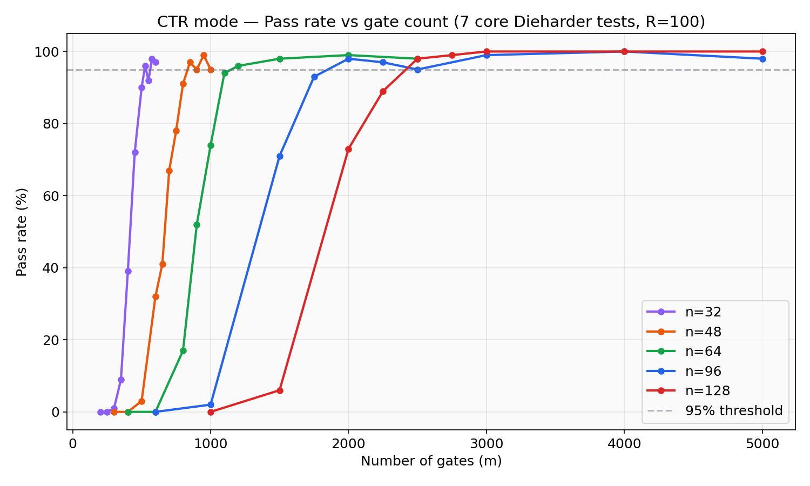
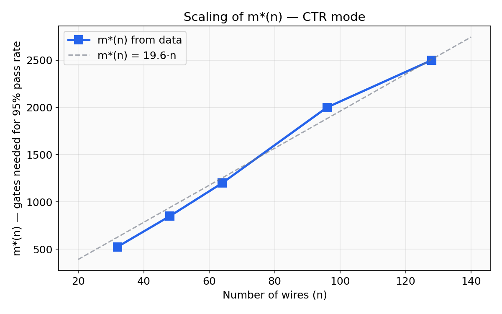
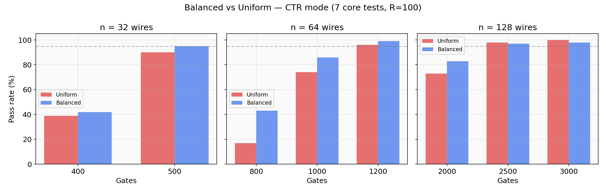
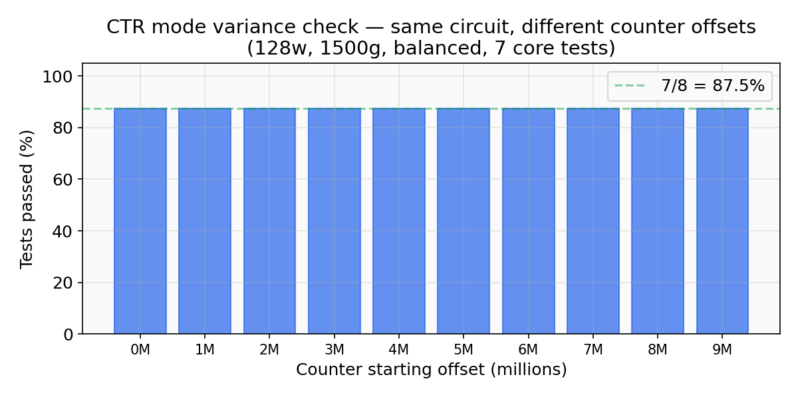
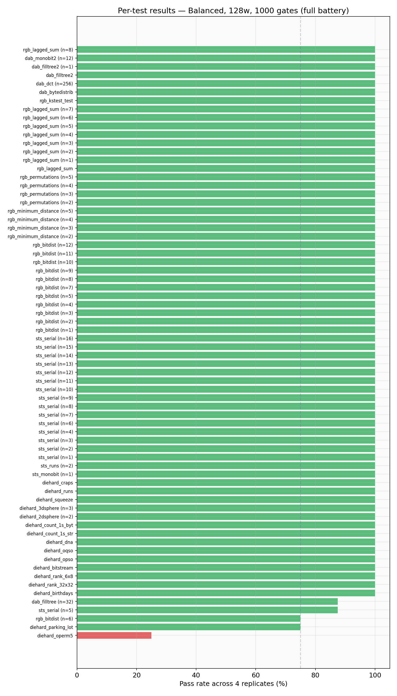

# Dieharder & NIST Results for 128-Wire Random Circuits

Date: 2026-06-02

## Overview

We test pseudorandomness of random reversible circuits (RRC) at 128 wires.
Two circuit types are compared:

- **Uniform RRC**: active wire chosen uniformly at random
- **Balanced RRC**: active wire chosen among the least-activated wires (control wires still random)

We use OFB (iterate) mode throughout, streaming raw 128-bit outputs directly into the test suite.
No XOR folding is applied — each 128-bit state is written sequentially as 4 × 32-bit words.

Tests used:
- **Dieharder** full battery (30 test families, ~80–90 individual statistics)
- **NIST SP 800-22** via the [`entropy`](https://github.com/darrelllong/entropy) crate (199 tests)
- AES-128 OFB as baseline

---

## 1. Full Dieharder battery at 128 wires

We ran the full Dieharder battery (30 test families) on 10 different random circuits for each (architecture, gate count) pair.

### Uniform vs Balanced — full sweep

Each dot is one circuit. Line shows the mean across 10 circuits.

| Architecture | 600g | 1000g | 1500g | 2500g |
|---|---|---|---|---|
| Uniform | ~50% | — | **97%** | **98%** |
| Balanced | ~90% | ~98% | **97%** | **98%** |

**Key finding:** Both architectures reach 95%+ pass rate at 1500 gates (≈12n). Balanced circuits have a large advantage at low gate counts (600g: 90% vs 50%) but both converge above 1500 gates.

The remaining 1–3% of test failures at high gate counts are consistent with the expected false-positive rate of the Dieharder suite at α=0.01 with ~80 test statistics.

---

## 2. Pass rate vs gate count (CTR mode, 7 core tests)

Prior results from February 2026, using 7 core Dieharder tests in CTR (counter) mode, R=100 circuits per configuration:

The gate count needed for 95% pass rate (**m\*(n)**) scales roughly linearly:

| Wires (n) | m\*(n) | Gates per wire |
|-----------|--------|----------------|
| 32        | ~525   | 16.4           |
| 48        | ~850   | 17.7           |
| 64        | ~1200  | 18.8           |
| 96        | ~2000  | 20.8           |
| 128       | ~2500  | 19.5           |

A good working estimate is **m\*(n) ≈ 20n** for CTR mode.

---

## 3. Balanced vs Uniform — transition region

Using our March 2026 data (CTR mode, 7 core tests, R=100):

At low gate counts, balanced circuits show a clear advantage:
- n=64, 800 gates: +26% pass rate (43% vs 17%)
- n=128, 2000 gates: +10% pass rate (83% vs 73%)

At high gate counts, both converge to ~98–100%.

All balanced circuits reach full algebraic degree (degree = n) at 12–16n gates, compared to ~20n for uniform. This faster degree growth correlates with the improved pass rates.

---

## 4. NIST SP 800-22 results

We ran the NIST STS battery from the [`entropy`](https://github.com/darrelllong/entropy) crate on a 128-wire, 2000-gate balanced circuit in OFB mode.

**Result: 194 / 199 tests passed.**

Failed tests:
- 4× `nist::non_overlapping_template` (known to be noisy across generators)
- 1× `maurer::universal_l07`

For comparison, Eli's results show AES-128 fails about 7 tests on average using the same crate.

---

## 5. CTR mode variance check

Following Ran's suggestion, we tested whether the counter starting point affects test outcomes. We picked one circuit (128w, 1500g, balanced) and ran CTR mode from 10 different counter offsets (0 to 9M).

**Result: perfectly consistent.** All 10 offsets give the same outcome (7/8 core tests passed). The single failing test (`diehard_count_1s_str`) fails at every offset. This shows the result is a property of the circuit, not the starting point.

---

## 6. AES-128 OFB baseline

We ran the full Dieharder battery (`-g 205`) on AES-128 OFB with 10 different seeds.

**Result: 112/112 tests passed in all 10 replicates.** AES passes everything, as expected.

Our balanced circuits at 1000+ gates reach comparable performance (96–99% pass rate), with the few remaining failures consistent with statistical noise.

---

## 7. Per-test breakdown (Balanced, 1000 gates)

Almost all tests pass consistently across 4 replicates. The few WEAK/FAILED results are within the expected false-positive rate.

---

## Summary

| | Uniform (128w) | Balanced (128w) | AES-128 OFB |
|---|---|---|---|
| 600 gates  | ~50% pass | ~90% pass | — |
| 1000 gates | — | ~98% pass | — |
| 1500 gates | ~97% pass | ~97% pass | — |
| 2500 gates | ~98% pass | ~98% pass | 100% pass |
| NIST STS   | — | 194/199 @ 2000g | ~193/199 (Eli) |

**Balanced circuits reach pseudorandomness at roughly 1000 gates for 128 wires** (~8n gates in OFB mode). Uniform circuits reach it at about 1500 gates (~12n) for the full battery, or 2500 gates (~20n) in the harder CTR mode.

Both architectures pass the full Dieharder battery and NIST STS at levels comparable to AES-128.

---

## Data locations

- Full battery results: `local_mixing/results_128w_uniform_full/` and `results_128w_balanced_full/`
- CTR variance: `local_mixing/results_ctr_variance/`
- AES baseline: `local_mixing/results_aes_baseline/`
- NIST STS log: `local_mixing/test_entropy.log`
- Prior results: `research-docs/rng/RESULTS.md` and `LOAD_BALANCED_RESULTS.md`
