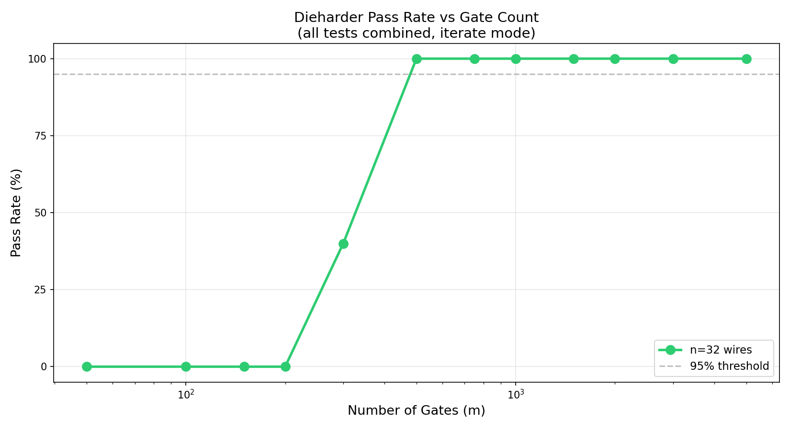
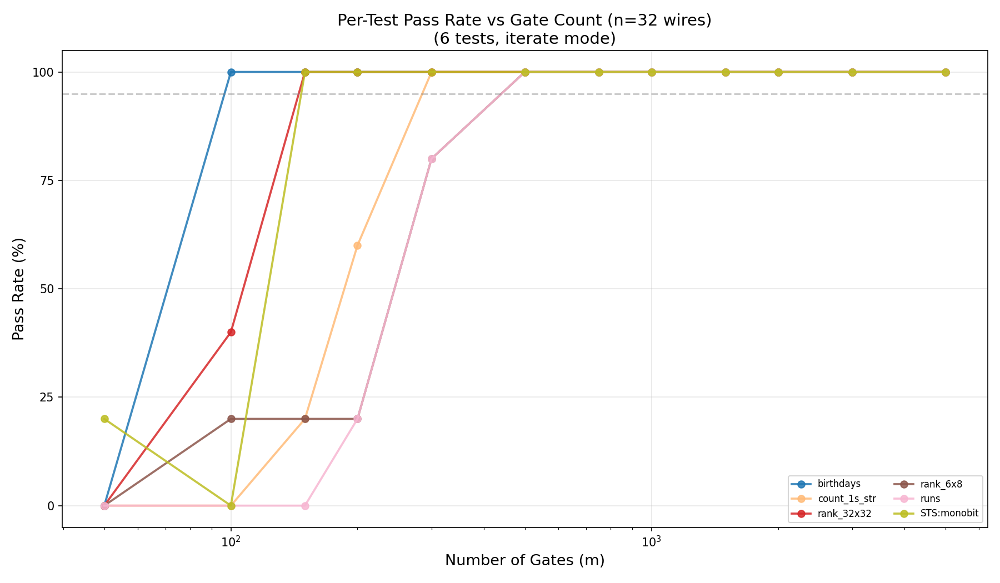
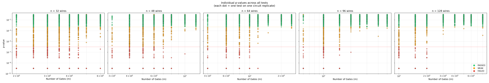
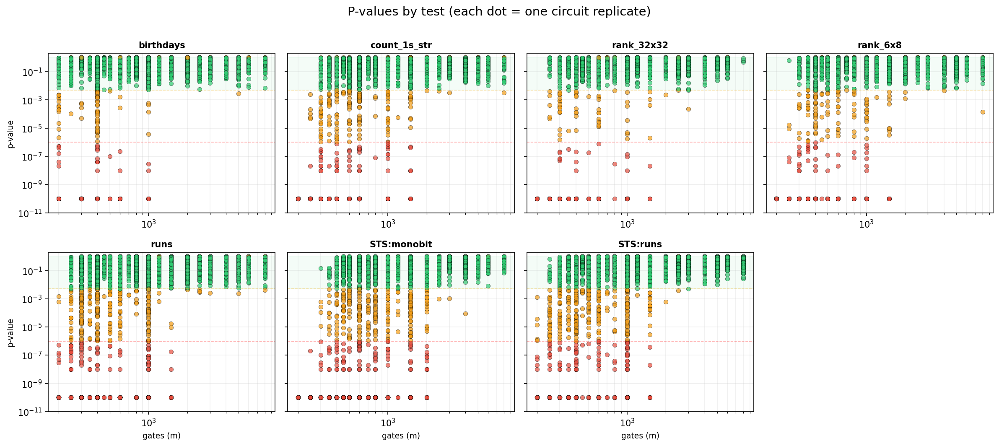
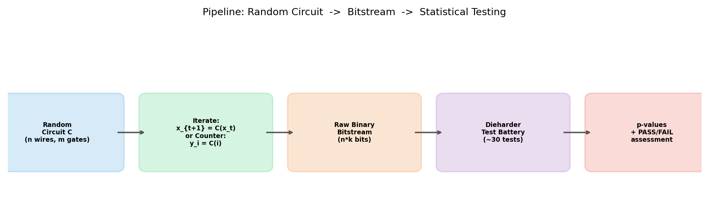

# RNG Sweep Results — Gate 57, n=32

Date: 2026-02-20

## Configuration

- **Gate**: 57 (`wire[a] ^= wire[b] OR (NOT wire[c])`)
- **Wires**: n = 32
- **Gate counts**: m = {50, 100, 150, 200, 300, 500, 750, 1000, 1500, 2000, 3000, 5000}
- **Replicates**: R = 5 per configuration
- **Stream mode**: iterate (`x_{t+1} = C(x_t)`)
- **Samples**: 50M per replicate (file mode)
- **Dieharder tests** (7 core):
  - `diehard_birthdays` (0)
  - `diehard_rank_32x32` (2)
  - `diehard_rank_6x8` (3)
  - `diehard_count_1s_str` (8)
  - `diehard_runs` (15)
  - `sts_monobit` (100)
  - `rgb_bitdist` (200)

**Note**: This sweep used file mode (200 MB files). Some tests (rank_32x32,
rgb_bitdist) may have experienced data reuse/rewinding. Future sweeps use pipe
mode to eliminate this issue. See [RNG_REPORT.md](RNG_REPORT.md) §3 for details.

## Summary Table

| m (gates) | Pass rate | Circuits passed | Notes |
|-----------|-----------|-----------------|-------|
| 50        | 0%        | 0/5             | All 7 tests FAIL |
| 100       | 0%        | 0/5             | Birthdays passes, rest fail |
| 150       | 0%        | 0/5             | Some individual tests pass |
| 200       | 0%        | 0/5             | Most tests pass, runs still fails |
| 300       | 40%       | 2/5             | First full passes appear |
| 500       | 100%      | 5/5             | All circuits pass all tests |
| 750       | 100%      | 5/5             | Stable |
| 1000      | 100%      | 5/5             | Stable |
| 1500      | 100%      | 5/5             | Stable |
| 2000      | 100%      | 5/5             | Stable |
| 3000      | 100%      | 5/5             | Stable |
| 5000      | 100%      | 5/5             | Stable |

**m\*(32) = 500 gates** (~15.6 gates/wire). The transition from 0% to 100% is
sharp, occurring in the 200–500 gate range.

## Plots

### Overall Pass Rate vs Gate Count

Sharp 0→100% transition between m=200 and m=500. The sigmoid-like curve shows
a clear threshold effect.

### Per-Test Pass Rate (n=32)

Shows which tests are easiest/hardest to pass. `diehard_birthdays` passes first
(from m=100), while `diehard_runs` is the bottleneck test that drives the
overall m* threshold.

### P-Value Scatter (All Tests)

P-values by gate count across all tests and replicates. Below m=200, p-values
cluster near 0 or 1 (non-uniform). Above m=500, p-values spread uniformly
across [0,1] as expected for good randomness.

### P-Values Per Test (6-Panel)

Breakdown of p-value distributions for each individual test. Shows the
per-test transition from structured to uniform p-values as gate count
increases.

### Pipeline Diagram

Overview of the testing pipeline: circuit generation → bitstream → dieharder.

## Key Findings

1. **Sharp threshold**: The pass rate transitions from 0% to 100% in a narrow
   band (m=200–500), consistent with a phase transition in pseudorandomness.

2. **~15 gates/wire**: m*(32) = 500 means roughly 15.6 gates per wire are
   needed for gate-57-only circuits to pass the core dieharder battery.

3. **Bottleneck test**: `diehard_runs` is the hardest test to pass, requiring
   more gates than other tests. This makes sense as run structure is sensitive
   to residual correlations.

4. **Stability above threshold**: Once past m=500, pass rate is rock-solid at
   100% all the way to m=5000. No regression.

## Next: Counter Mode Sweep

Counter mode evaluates C(0), C(1), C(2), ..., C(k) instead of iterating
C(C(...C(x))). This tests function quality on structured inputs rather than
cycle structure.

A counter mode sweep with the same configuration (n=32, same gate counts, R=5,
pipe mode) is now running.
