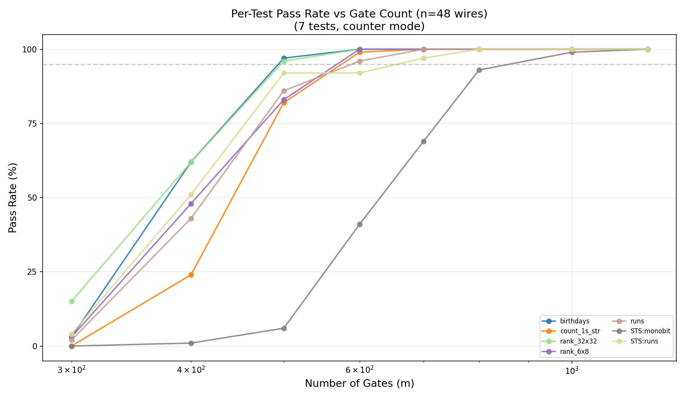
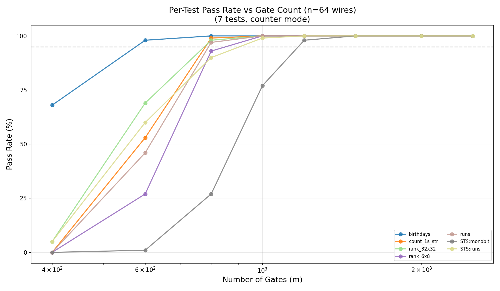
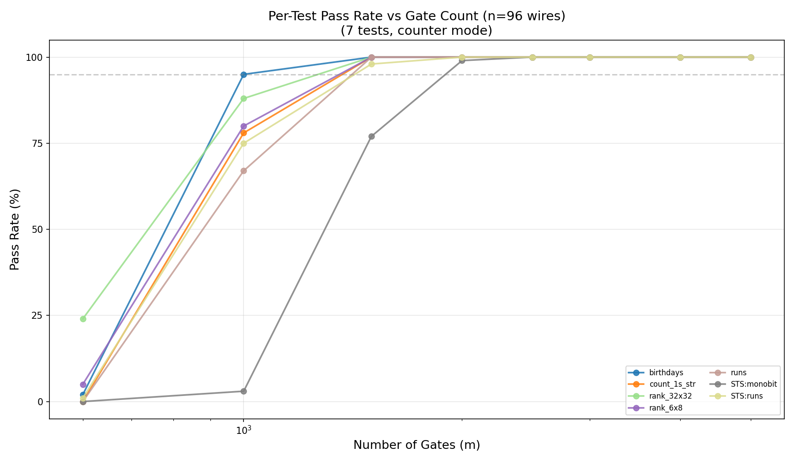
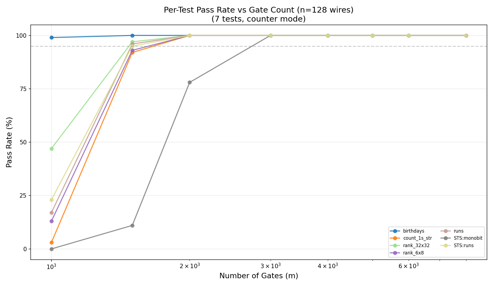

# RNG Sweep Results — Gate 57

Date: 2026-02-21

## Stream Modes (Block Cipher Modes of Operation)

We test the same circuit C in two standard modes (see NIST SP 800-38A):

**CTR (Counter) mode** (`C(0), C(1), C(2), ...`): each output is a **single
application** of the circuit to a distinct counter value. No chaining, no
cumulative mixing. This is the harder test — the circuit must be a good
**pseudorandom permutation (PRP)** in a single shot.

**OFB (Output Feedback) mode** (`IV → C(IV) → C(C(IV)) → ...`): each output
is fed back as the next input, so the k-th output is C^k(IV). This is
equivalent to our **iterate mode**. The USE report (Chamon et al.) and the
professor's group used OFB. It is an easier test because millions of
cumulative re-applications provide extra mixing even if C alone is a weak PRP.

**PRP (Pseudorandom Permutation)** is the *property* we are testing, not a mode.
A good PRP should pass tests in both modes. CTR mode is the stricter test of
PRP quality because each output depends on exactly one application of C.

**m\*(n) from CTR/counter mode is the number to report.** OFB/iterate results
are for comparison with prior work.

---

## Cluster Sweep Results (Phase 1) — Counter Mode, R=100

Gate 57, 7 core dieharder tests (pipe mode), max_weak=1, 50M samples.

### n=32

| m (gates) | Pass rate | Passed/100 |
|-----------|-----------|------------|
| 200 | 0% | 0/100 |
| 250 | 0% | 0/100 |
| 300 | 1% | 1/100 |
| 350 | 9% | 9/100 |
| 400 | 39% | 39/100 |
| 450 | 72% | 72/100 |
| 500 | 90% | 90/100 |
| 600 | **97%** | 97/100 |

### n=48

| m (gates) | Pass rate | Passed/100 |
|-----------|-----------|------------|
| 300 | 0% | 0/100 |
| 400 | 0% | 0/100 |
| 500 | 3% | 3/100 |
| 600 | 32% | 32/100 |
| 700 | 67% | 67/100 |
| 800 | 91% | 91/100 |
| 1000 | **95%** | 95/100 |
| 1200 | **97%** | 97/100 |

### n=64

| m (gates) | Pass rate | Passed/100 |
|-----------|-----------|------------|
| 400 | 0% | 0/100 |
| 600 | 0% | 0/100 |
| 800 | 17% | 17/100 |
| 1000 | 74% | 74/100 |
| 1200 | **96%** | 96/100 |
| 1500 | **98%** | 98/100 |
| 2000 | **99%** | 99/100 |
| 2500 | **98%** | 98/100 |

### n=96

| m (gates) | Pass rate | Passed/100 |
|-----------|-----------|------------|
| 600 | 0% | 0/100 |
| 1000 | 2% | 2/100 |
| 1500 | 71% | 71/100 |
| 2000 | **98%** | 98/100 |
| 2500 | **95%** | 95/100 |
| 3000 | **99%** | 99/100 |
| 4000 | **100%** | 100/100 |
| 5000 | **98%** | 98/100 |

### n=128

| m (gates) | Pass rate | Passed/100 |
|-----------|-----------|------------|
| 1000 | 0% | 0/100 |
| 1500 | 6% | 6/100 |
| 2000 | 73% | 73/100 |
| 3000 | **100%** | 100/100 |
| 4000 | **100%** | 100/100 |
| 5000 | **100%** | 100/100 |
| 6000 | **100%** | 100/100 |
| 8000 | **100%** | 100/100 |

---

## m\*(n) Summary (95% threshold, counter mode)

| Width (n) | m\*(n) | Gates/wire | Transition region |
|-----------|--------|------------|-------------------|
| 32 | ~600 | 18.8 | 350–600 |
| 48 | ~1000 | 20.8 | 600–1000 |
| 64 | ~1200 | 18.8 | 800–1200 |
| 96 | ~2000 | 20.8 | 1500–2000 |
| 128 | ~3000 | 23.4 | 2000–3000 |

Scaling: m\*(n) ≈ 20n (gates per wire), possibly with a weak logarithmic correction.

---

## Observations

1. **Gradual transition at R=100.** The R=5 local sweep suggested a sharp 0→100%
   jump, but at R=100 the S-curve is smooth. The transition spans roughly a factor
   of 2 in gate count (e.g., n=32: 350–600, n=64: 800–1200).

2. **Pass rates plateau at 95–99%, not 100%.** At very high gate counts (e.g.,
   n=96 g=5000: 98%, n=64 g=2500: 98%), occasional WEAK results still cause
   failures. This is expected stochastic noise at R=100 with max_weak=1.

3. **Bottleneck test: sts_monobit (ID 100).** In the transition region, sts_monobit
   is consistently the last test to pass. Failed replicates at intermediate gate
   counts almost always show sts_monobit as the sole FAILED test while all other
   6 tests pass.

4. **m\*(32) revised upward.** Local R=5 suggested m\*(32)=500. At R=100, g=500
   gives only 90% pass rate. The 95% threshold is at ~600 gates.

5. **Linear scaling.** Gates per wire is roughly constant at ~19–23 across all
   widths tested, suggesting m\*(n) = O(n) with a constant around 20.

---

## Local Results (R=5, n=32, legacy)

### Counter Mode (pipe mode)

| m (gates) | Pass rate | Circuits passed |
|-----------|-----------|-----------------|
| 50 | 0% | 0/5 |
| 100 | 0% | 0/5 |
| 150 | 0% | 0/5 |
| 200 | 0% | 0/5 |
| 300 | 0% | 0/5 |
| 500 | 100% | 5/5 |
| 750 | 100% | 5/5 |

### Iterate Mode (file mode, legacy)

| m (gates) | Pass rate | Circuits passed |
|-----------|-----------|-----------------|
| 50 | 0% | 0/5 |
| 100 | 0% | 0/5 |
| 150 | 0% | 0/5 |
| 200 | 0% | 0/5 |
| 300 | 40% | 2/5 |
| 500 | 100% | 5/5 |
| 750+ | 100% | 5/5 |

---

## Plots

### Overall Pass Rate vs Gate Count (all widths, counter mode)

S-curves for all 5 widths showing the phase transition. Wider circuits require
proportionally more gates. The transition sharpness is similar across widths.

### Per-Test Pass Rate

- 
- 
- 
- 
- 

### P-Value Scatter

### P-Values Per Test

### Pipeline Diagram

---

## Comparison with USE Report (Chamon et al.)

| Aspect | USE Report | Our Work |
|--------|-----------|----------|
| Cipher | USE block cipher (hierarchical) | Random gate-57 circuits |
| Mode | OFB (= our iterate mode) | Counter (harder) + iterate |
| Dieharder | Full battery (~114 tests) | 7 core tests (Phase 1) |
| NIST STS | Full suite (188 tests) | Not yet (Phase 4) |
| Widths | Fixed (3^l bits) | 32, 48, 64, 96, 128 |
| Replicates | 1 config × 300 sequences | 100 random circuits per (n,m) |

**Key difference**: We test many random circuits at varying depths to find the
pseudorandomness threshold. They test one fixed cipher to confirm it's random.

---

## What Remains

See [CLUSTER_RNG.md](../local_mixing/CLUSTER_RNG.md) for the full cluster deployment guide.

1. **Phase 2**: Denser gate counts in transition regions (1,400 jobs)
2. **Phase 3**: Full dieharder battery at strategic points (300 jobs)
3. **Phase 4**: NIST STS (188 tests) for comparability with USE report (200 jobs)
4. **Phase 5**: Iterate mode comparison (800 jobs)
5. **Scaling law fit**: m\*(n) ~ n^alpha or n*log(n) from the 5+ data points
